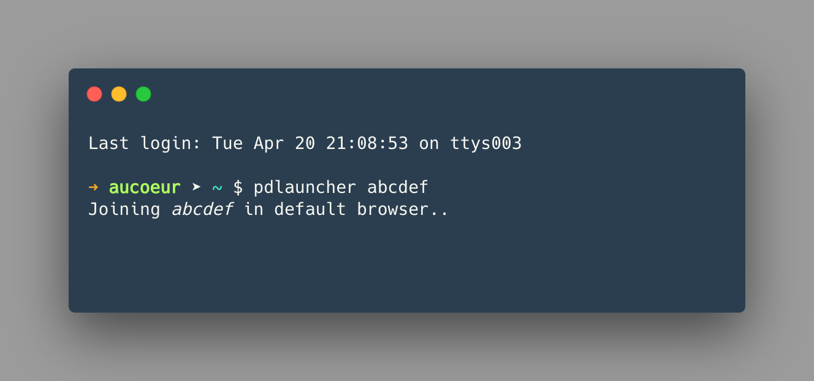

# pd launcher
 

  

launches pear deck in-browser via terminal   

## Install Globally
`npm install -g pdlauncher`

## To Use
You can use `pdlauncher` with or without a join code

- `pdlauncher` opens joinpd.com in your default browser  
- `pdlauncher [abxyz]` will attempt to join your room, will return error if code is not 5-6 letters or if there is no session found, authJoin should also redirect to proper student link

## Test Locally
- Link, `npm link`
- Unlink:  `npm unlink -g pdlaunche`
